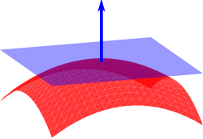
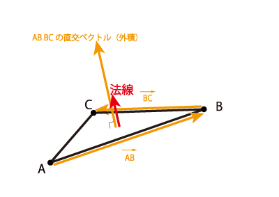

# Day 15｜WebGL（5）

昨天我們認識了 Shader 與 GLSL，也知道 Vertex Shader 負責決定頂點的位置，Fragment Shader 則負責輸出片段最後的顏色。

不過到目前為止，立方體的顏色都只來自頂點資料，想要讓 3D 看起來立體，就必須考慮光影對顏色的影響。

今天我們延續 Day 13 的立方體，在場景中加入一盞固定角度的平行光，並透過 Shader 計算表面受光後的顏色。👉🏿 Demo 連結

### 固定角度的平行光

平行光（Directional Light）可以想像成距離非常遙遠的光源，例如太陽。因為光源離場景很遠，所以到達物體附近時，每一道光線都可以視為彼此平行。

點光源需要知道光源位置，並用「表面位置到光源位置」計算每一點不同的方向；平行光則不需要位置，只要一個固定的方向即可。因此，立方體無論放在場景中的哪裡，都會使用相同的光線方向。

這次我們在 JavaScript 中設定一個固定方向：

```jsx
const lightDirection = normalize([-1, 2, 3]);
```

這個向量代表「從表面指向光源」的方向。也就是說，光源位於場景的左上前方。

方向向量只需要描述方向，不應該讓長度影響亮度，所以在傳入 Shader 前要先將它正規化，讓長度變成 `1`：

```jsx
function normalize(vector) {
  const length = Math.hypot(...vector) || 1;
  return vector.map((value) => value / length);
}
```

接著透過 `uniform` 將同一個光線方向提供給這次繪製的所有頂點：

```jsx
const lightDirectionLocation = gl.getUniformLocation(
  program,
  "u_lightDirection",
);

gl.uniform3fv(lightDirectionLocation, normalize([-1, 2, 3]));
```

雖然這次角度是固定的，仍然將它設計成 `uniform`，而不是直接把數值寫死在 GLSL 裡。如此一來，之後想從 JavaScript 改變光源方向時，不需要重新編譯 Shader。

### 光線怎麼知道一個面朝向哪裡

只有光線方向還不夠，我們還要知道模型表面朝向哪裡。這個方向就是法線（Normal）。



模型通常由許多三角形組成，因此可以用三角形的三個頂點來計算法線。



如圖所示，`AB` 和 `BC` 是三角形表面上的兩條邊。把這兩個向量做外積，就能算出垂直於表面的紅色法線：

```jsx
function calculateFaceNormal(a, b, c) {
  const ab = [b[0] - a[0], b[1] - a[1], b[2] - a[2]];
  const bc = [c[0] - b[0], c[1] - b[1], c[2] - b[2]];

  return normalize([
    ab[1] * bc[2] - ab[2] * bc[1],
    ab[2] * bc[0] - ab[0] * bc[2],
    ab[0] * bc[1] - ab[1] * bc[0],
  ]);
}
```

每次取出模型的一個三角形，把三個頂點丟進 `calculateFaceNormal()`，就能得到這個面的法線。再把法線和位置、顏色一起存進 Buffer：

```jsx
const normal = calculateFaceNormal(a, b, c);
vertices.push(...position, ...color, ...normal);
```

每一筆頂點現在包含 9 個 `float`：

```text
position.xyz + color.rgb + normal.xyz
```

因此每筆資料的 stride 是 `9 × 4 = 36 bytes`，法線要跳過前面的 6 個 `float`，從第 24 byte 開始讀取：

```jsx
const normalLocation = gl.getAttribLocation(program, "a_normal");

gl.enableVertexAttribArray(normalLocation);
gl.vertexAttribPointer(normalLocation, 3, gl.FLOAT, false, 36, 24);
```

### 法線也要跟著模型旋轉

Buffer 裡的 `a_normal` 和 `a_position` 一樣，一開始都位於 Model Space。如果只旋轉頂點位置，卻沒有旋轉法線，畫面中的立方體雖然轉動了，Shader 仍然會用原本的表面方向計算光照，亮面就會黏在錯誤的位置。

因此法線也要經過 Model Matrix 的旋轉：

```glsl
vec3 normal = normalize(mat3(u_model) * a_normal);
```

`a_normal` 描述的是方向，不是位置，不應該受到位移影響，所以這裡將 `mat4` 的 Model Matrix 轉成 `mat3`，只保留左上角負責旋轉與縮放的部分。運算後再呼叫 `normalize()`，讓法線維持單位長度。

這次的模型只有旋轉，因此使用 `mat3(u_model)` 就足夠。如果模型之後加入不等比例縮放，則要改用 Normal Matrix，也就是 Model Matrix 左上 `3 × 3` 矩陣的反矩陣轉置，才能維持正確的法線方向。

### 用內積計算表面面向光源的程度

現在 Shader 中有兩個單位向量：

- `normal`：表面朝向
- `u_lightDirection`：表面指向光源的方向

兩個單位向量的內積（dot product）可以告訴我們它們有多接近：

```glsl
float diffuse = dot(normal, u_lightDirection);
```

假設兩個向量之間的夾角是 `θ`，單位向量的內積就等於：

```text
dot(N, L) = cos(θ)
```

結果可以這樣理解：

| 夾角   | 內積 | 表面狀態                     |
| ------ | ---: | ---------------------------- |
| `0°`   |  `1` | 正對光源，最亮               |
| `90°`  |  `0` | 光線與表面平行，沒有漫反射光 |
| `180°` | `-1` | 完全背對光源                 |

負數代表光線照到表面的背面。這次不計算背面的光，因此用 `max()` 將結果限制在 `0` 以上：

```glsl
float diffuse = max(dot(normal, u_lightDirection), 0.0);
```

這就是最基本的 Lambert diffuse lighting（Lambert 漫反射）。表面越朝向光源，得到的漫反射強度越高；越偏離光源，強度就越接近 `0`。

### 避免背光面變成全黑

如果直接將漫反射強度乘上原色，所有背對光源的面都會變成黑色：

```glsl
vec3 litColor = a_color * diffuse;
```

真實環境中，光會經過牆面、地面與其他物體反射，背光面通常不會完全沒有光。今天先用一個簡化的環境光（Ambient Light）保留基本亮度：

```glsl
float ambient = 0.55;
float diffuseStrength = 0.45;
float light = ambient + diffuseStrength * diffuse;
```

這裡的環境光固定是 `0.55`，漫反射最多再增加 `0.45`，所以最後的光照強度會落在 `0.55` 到 `1.0` 之間：

```text
背對光源：0.55 + 0.45 × 0 = 0.55
正對光源：0.55 + 0.45 × 1 = 1.00
```

最後將頂點原色乘上光照強度：

```glsl
v_color = a_color * light;
```

如果某個頂點原本的顏色是：

```glsl
vec3 color = vec3(0.80, 0.40, 0.20);
```

而算出的 `diffuse` 是 `0.5`，那麼：

```text
light = 0.55 + 0.45 × 0.5 = 0.775

litColor = (0.80, 0.40, 0.20) × 0.775
         = (0.62, 0.31, 0.155)
```

RGB 三個分量都乘上同一個強度後，色相大致不變，亮度則會隨表面朝向改變。

### 完整的 Vertex Shader

將位置、顏色、法線與光線方向放在一起，這次的 Vertex Shader 會變成：

```glsl
attribute vec3 a_position;
attribute vec3 a_color;
attribute vec3 a_normal;

uniform mat4 u_model;
uniform mat4 u_view;
uniform mat4 u_projection;
uniform vec3 u_lightDirection;

varying vec3 v_color;

void main() {
  vec4 worldPosition = u_model * vec4(a_position, 1.0);

  // 將 Model Space 的法線轉到 World Space
  vec3 normal = normalize(mat3(u_model) * a_normal);

  // 計算 Lambert 漫反射，背光面的強度限制為 0
  float diffuse = max(dot(normal, u_lightDirection), 0.0);

  // 加入固定環境光，再用總強度調整頂點原色
  float light = 0.55 + 0.45 * diffuse;
  v_color = a_color * light;

  gl_Position = u_projection * u_view * worldPosition;
}
```

這次在 Vertex Shader 計算光照，再把受光後的 `v_color` 傳給 Fragment Shader。光柵化時，GPU 會在三角形的頂點之間插值顏色，Fragment Shader 只需要輸出收到的結果：

```glsl
precision mediump float;

varying vec3 v_color;

void main() {
  gl_FragColor = vec4(v_color, 1.0);
}
```

> 由於立方體同一個面的頂點共用相同法線，所以同一面的漫反射強度一致，會呈現平坦、清楚的面。這種效果稱為 Flat Shading，也很適合觀察立方體的結構。

再提醒一個重要的小觀念

旋轉模型時，`u_model` 會更新，表面相對於固定光源的夾角改變，亮度也跟著改變；旋轉相機時，只有 `u_view` 更新，亮度不變。

所以需要特別注意的是，進行向量運算前，參與計算的向量必須位於同一個座標空間。不能拿 Model Space 的法線直接和 World Space 的光線方向做內積，否則模型旋轉後就會得到錯誤結果。

### 小結

今天我們在原本只有頂點顏色的立方體上加入固定角度的平行光，完成最基本的漫反射光照：

```text
頂點法線
→ 用 Model Matrix 轉到 World Space
→ 與 World Space 的光線方向做內積
→ 得到 Lambert 漫反射強度
→ 加上簡化的環境光
→ 乘上頂點原色
→ 輸出受光後的顏色
```

目前這盞平行光仍然是固定方向，而且只有環境光與漫反射。接下來還可以加入可控制的光源方向、光源顏色，以及會隨觀察角度改變的鏡面反射，讓材質呈現更多層次。
