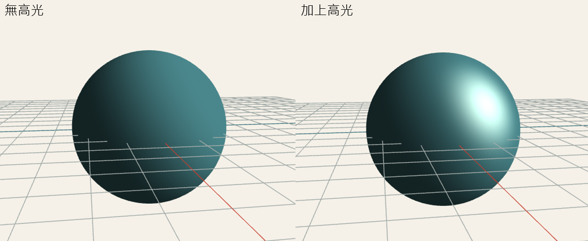
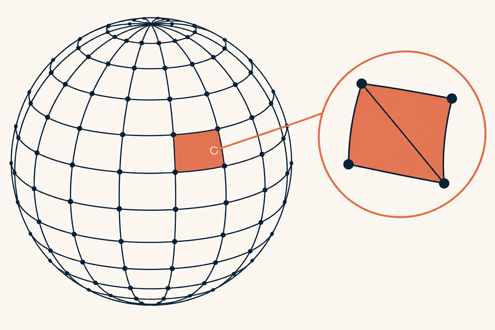
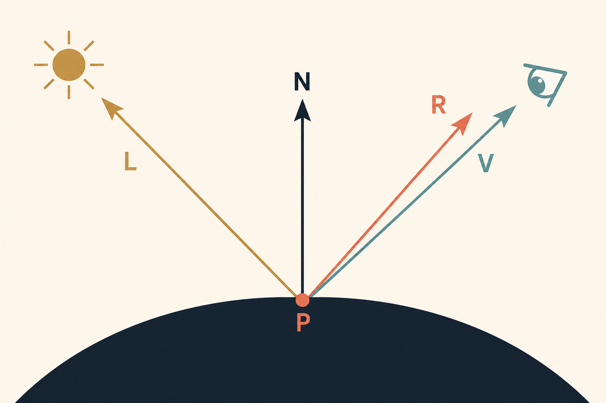

# Day 16｜WebGL（6）球體上的鏡面反射

昨天我們講解了光影如何改變物體的顏色，但如果想更細緻地討論光影，就必須進一步考慮材質。

今天我們就來看看光滑表面在光線照射下會產生什麼變化——高光與鏡面反射。👉🏿 Demo 連結


### 建立球體模型

立方體的每個面都是平的，同一個面上的法線方向也完全相同，因此很適合用來觀察明確的明暗分界；但要觀察連續移動的高光，表面平滑的球體會更直覺。

這次使用的是 UV Sphere。類似在地球儀上畫出經線與緯線，將球體拆成小格，每個小格最後拆成兩個三角形。



### 準備 UV Sphere 的頂點與法線

緯度角 `phi` 從 `0` 走到 `π`，經度角 `theta` 則從 `0` 繞到 `2π`；兩層迴圈會依序走過每個經緯度交點，利用三角函數算出球面上的 `x`、`y`、`z`，再乘上半徑得到頂點位置。由於球心位於原點，從球心指向頂點的單位向量也正好就是該頂點的法線，因此同一組數值可以同時用來建立 `positions` 與 `normals`。

```jsx
function createSphereVertices(
  radius = 1, // 球體半徑
  latitudeBands = 32, // 緯度方向的分段數(從上到下)
  longitudeBands = 32, // 經度方向的分段數(繞一圈)
) {
  const positions = []; // 儲存所有頂點的座標 (x, y, z)
  const normals = []; // 儲存每個頂點的法向量 (用於光照計算)

  // 由上到下遍歷每一條緯線(0 = 北極, latitudeBands = 南極)
  for (let latitude = 0; latitude <= latitudeBands; latitude += 1) {
    // phi:從 y 軸正方向算起的極角,範圍 0 ~ π
    const phi = (latitude / latitudeBands) * Math.PI;
    const sinPhi = Math.sin(phi);
    const cosPhi = Math.cos(phi);

    // 繞著 y 軸遍歷每一條經線,範圍 0 ~ 2π
    for (let longitude = 0; longitude <= longitudeBands; longitude += 1) {
      // theta:繞 y 軸旋轉的方位角
      const theta = (longitude / longitudeBands) * Math.PI * 2;
      const sinTheta = Math.sin(theta);
      const cosTheta = Math.cos(theta);

      // 依球座標公式計算單位法向量 (球心到該點的方向)
      const normalX = sinPhi * cosTheta;
      const normalY = cosPhi;
      const normalZ = sinPhi * sinTheta;

      // 頂點座標 = 法向量 * 半徑(因為球心在原點,單位法向量方向即頂點方向)
      positions.push(radius * normalX, radius * normalY, radius * normalZ);
      // 法向量直接儲存(單位長度,供光照 shader 使用)
      normals.push(normalX, normalY, normalZ);
    }
  }

  // 回傳頂點位置與法向量,轉成 Float32Array 以利 WebGL 使用
  return {
    positions: new Float32Array(positions),
    normals: new Float32Array(normals),
  };
}
```

將球體的頂點資料準備好後，我們就可以開始計算高光了。接下來會把頂點位置與法線交給 Shader，並在 Fragment Shader 中取得球面每個位置的法線方向，再配合光線方向與相機方向計算反射光；當反射光越接近相機，高光就會越明顯，最後再把高光與原本的環境光、漫反射組合成球體的顏色。

### 鏡面反射為什麼和觀察位置有關

鏡面高光不只受到光線方向影響，也會隨著相機觀看表面的角度改變位置。

漫反射只比較表面法線 `N` 與光線方向 `L`。只要模型和光源沒有移動，無論相機從哪裡觀看，漫反射結果都不會改變。

鏡面反射則不同。光線抵達表面後，會依照法線方向反射；只有當反射方向剛好接近觀察者時，我們才會看到明顯的高光。因此計算時會用到以下四個方向，其中 `R` 會由 `L` 與 `N` 算出：

```text
N：表面法線方向
L：表面指向光源的方向
R：光線反射後的方向
V：表面指向相機的方向
```



當 `R` 越接近 `V`，相機接收到的反射光越強，高光就越明顯。
這也是為什麼轉動相機時，即使模型與光源都沒有改變，球面上的高光仍會移動。

### 計算視線與反射方向，找出高光位置

從前面的圖可以知道，高光的強弱取決於反射方向 `R` 是否接近視線方向 `V`，所以我們要先在 Fragment Shader 中算出這兩個方向。`V` 是從目前的表面位置指向相機，因此用相機位置 `u_cameraPosition` 減去表面的世界座標 `v_worldPosition`；兩者都位於 World Space，相減後再正規化，就能得到只表示方向的單位向量。

接著使用 GLSL 的 `reflect()` 計算反射方向 `R`。目前的 `lightDirection` 是由表面指向光源的 `L`，但 `reflect()` 需要接收朝向表面射入的方向，所以要傳入相反方向 `-lightDirection`。最後將 `V` 和 `R` 做內積：兩者越接近，結果就越靠近 `1`，高光也越明顯；角度越偏，結果則越接近 `0`。

```glsl
// V：表面指向相機的方向
vec3 viewDirection = normalize(
  u_cameraPosition - v_worldPosition
);

// R：入射光沿著法線反射後的方向
vec3 reflectedDirection = reflect(-lightDirection, normal);

// 比較 V 與 R 的接近程度
float specularAngle = max(
  dot(viewDirection, reflectedDirection),
  0.0
);

float specular = 0.0;

// 只有朝向光源的表面才計算高光
if (diffuse > 0.0) {
  specular = pow(specularAngle, u_shininess);
}
```

這裡先用 `diffuse > 0.0` 確認表面朝向光源，避免光線位於球體背面時仍然出現高光。至於 `pow()` 中的 `u_shininess`，則是下一段用來控制高光範圍的參數。

### Shininess：控制高光的集中程度

`shininess` 數值越高，高光會越小且集中；數值越低，高光則會變得柔和而分散。

直接使用 `specularAngle` 時，高光的範圍會非常大。Phong 反射模型會使用 `pow()` 將它乘方，控制亮度隨角度下降的速度：

```glsl
float specular = pow(specularAngle, u_shininess);
```

假設 `specularAngle` 是 `0.8`：

| `shininess` |   計算結果 | 高光表現       |
| ----------: | ---------: | -------------- |
|         `4` |   `0.4096` | 寬廣、柔和     |
|        `16` |   `0.0281` | 範圍明顯縮小   |
|        `64` | `0.000001` | 集中在反射中心 |

`shininess` 並不是亮度。它控制的是高光範圍，實際強度可以另外使用 `u_specularStrength` 調整：

```glsl
specular *= u_specularStrength;
```

Demo 可以用滑桿即時更新這兩個 uniform：

```jsx
gl.uniform1f(shininessLocation, shininess);
gl.uniform1f(specularStrengthLocation, specularStrength);
```

例如將 `shininess` 限制在 `2` 到 `128`，`specularStrength` 限制在 `0` 到 `1`，就能清楚比較柔和材質與光滑材質的差異。

### 計算光照

前面已經算出表面接收到的漫反射，以及反射光接近相機時產生的鏡面高光，接下來只要加上環境光提供的基本亮度，就能組合出球體最後的光照效果。

先算出環境光與漫反射：

```glsl
vec3 ambientColor = u_baseColor * 0.22;
vec3 diffuseColor = u_baseColor * diffuse * 0.78;
```

環境光讓背光面保留基本顏色，漫反射則按照表面面向光源的程度增加亮度。兩者都使用球體的 `u_baseColor`。

鏡面反射代表光源直接反射到相機的亮光，通常另外設定顏色：

```glsl
vec3 specularColor =
  u_specularColor * specular * u_specularStrength;
```

最後將三部分加在一起：

```glsl
vec3 finalColor = ambientColor + diffuseColor + specularColor;
gl_FragColor = vec4(min(finalColor, vec3(1.0)), 1.0);
```

`min()` 將每個 RGB 分量限制在 `1.0` 以內，避免三種光照相加後超出可輸出的顏色範圍。

這次使用的是簡化的 Phong 反射模型：

```text
最終顏色 = 環境光 + 漫反射 + 鏡面反射
```

它不是真實世界中完整的光線模擬，但很適合用來理解表面方向、光源與觀察者如何共同決定材質外觀。

### 完整的 Vertex Shader

接著把座標轉換、世界座標與法線輸出整理成完整的 Vertex Shader。

```glsl
attribute vec3 a_position;
attribute vec3 a_normal;

uniform mat4 u_model;
uniform mat4 u_view;
uniform mat4 u_projection;

varying vec3 v_worldPosition;
varying vec3 v_worldNormal;

void main() {
  vec4 worldPosition = u_model * vec4(a_position, 1.0);

  // 將 Fragment Shader 需要的資料保持在 World Space
  v_worldPosition = worldPosition.xyz;
  v_worldNormal = normalize(mat3(u_model) * a_normal);

  gl_Position = u_projection * u_view * worldPosition;
}
```

這次 Vertex Shader 不再計算最後的顏色，只負責轉換頂點，並把每個頂點的世界座標與世界法線交給下一個階段。

### 完整的 Fragment Shader

最後整合環境光、Lambert 漫反射與 Phong 鏡面反射，完成球體的逐像素光照。

```glsl
precision mediump float;

uniform vec3 u_lightDirection;
uniform vec3 u_cameraPosition;
uniform vec3 u_baseColor;
uniform vec3 u_specularColor;
uniform float u_specularStrength;
uniform float u_shininess;

varying vec3 v_worldPosition;
varying vec3 v_worldNormal;

void main() {
  // 插值後的法線需要重新正規化
  vec3 normal = normalize(v_worldNormal);
  vec3 lightDirection = normalize(u_lightDirection);

  // Lambert 漫反射
  float diffuse = max(dot(normal, lightDirection), 0.0);

  // Phong 鏡面反射
  vec3 viewDirection = normalize(u_cameraPosition - v_worldPosition);
  vec3 reflectedDirection = reflect(-lightDirection, normal);
  float specular = 0.0;

  if (diffuse > 0.0) {
    float specularAngle = max(
      dot(viewDirection, reflectedDirection),
      0.0
    );
    specular = pow(specularAngle, u_shininess);
  }

  // 組合環境光、漫反射與鏡面反射
  vec3 ambientColor = u_baseColor * 0.22;
  vec3 diffuseColor = u_baseColor * diffuse * 0.78;
  vec3 specularColor =
    u_specularColor * specular * u_specularStrength;
  vec3 finalColor = ambientColor + diffuseColor + specularColor;

  gl_FragColor = vec4(min(finalColor, vec3(1.0)), 1.0);
}
```

JavaScript 端只要在繪製前提供光線方向、相機位置、球體顏色與高光參數，就能控制材質的外觀：

```jsx
gl.uniform3fv(lightDirectionLocation, normalize([-1, 2, 3]));
gl.uniform3fv(cameraPositionLocation, [0, 0, 4.5]);
gl.uniform3fv(baseColorLocation, [0.25, 0.5, 0.72]);
gl.uniform3fv(specularColorLocation, [1.0, 0.95, 0.85]);
gl.uniform1f(specularStrengthLocation, 0.7);
gl.uniform1f(shininessLocation, 32);
```

現在轉動球體時，法線方向會跟著改變；移動相機或改變光線方向時，高光位置也會重新計算。透過 Demo 的 `shininess` 與高光強度控制，就能直接看到同一個球體如何呈現不同材質感。
