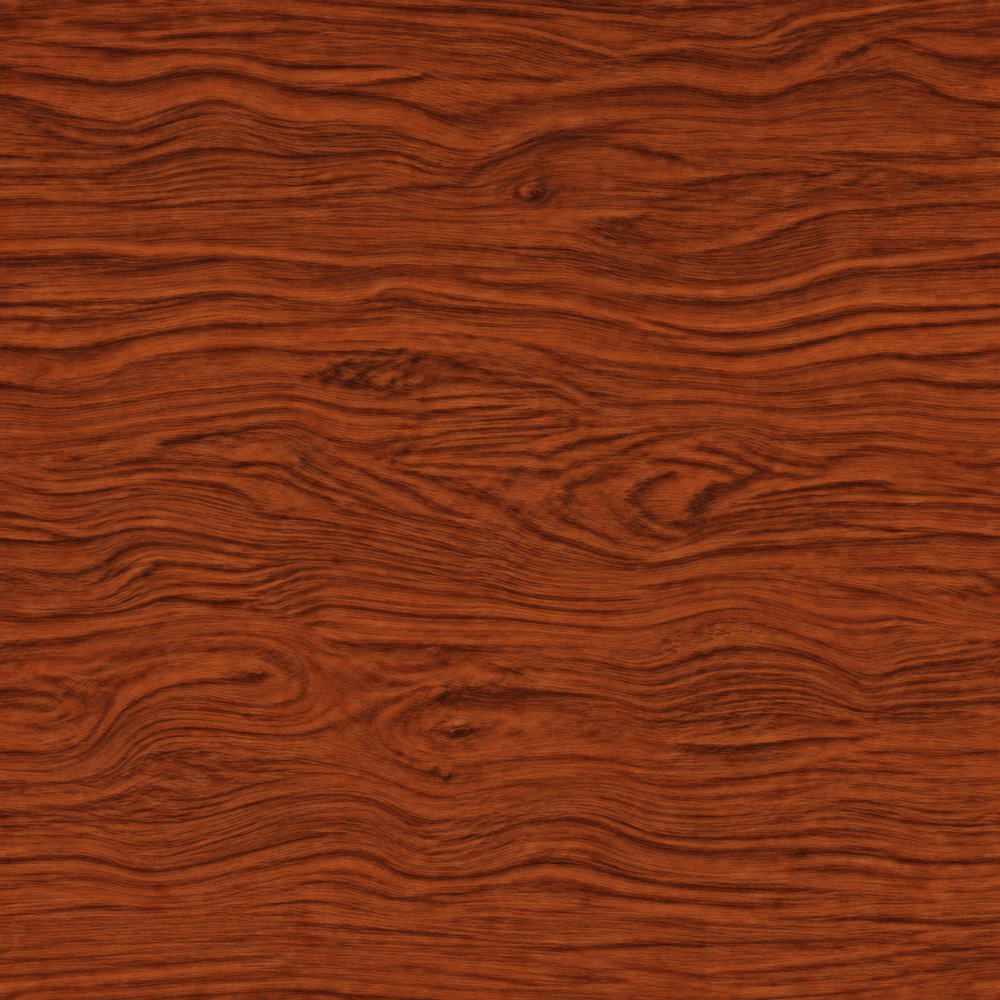
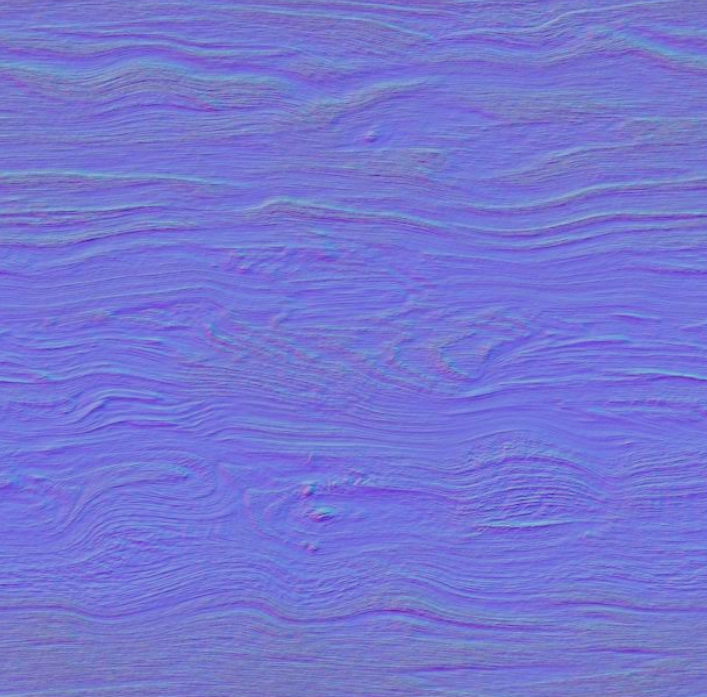

# Day 22｜Three.js(5) UV 與材質貼圖：讓球體有木頭的樣子

昨天認識了 `displacementMap` 與 `bumpMap`，分別用來改變模型輪廓，以及模擬表面的凹凸光照。

今天繼續使用同一顆球體，再講解另外兩種貼圖：顏色貼圖 `map` 與法線貼圖 `normalMap`。這次換成木紋，看看不同貼圖搭配後，會如何影響球體的外觀。

### COLOR / 顏色貼圖

顏色貼圖最容易理解，就是把圖片上的顏色放到模型表面。在 Three.js 中，對應的材質屬性叫做 `map`。

這次使用紅棕色木紋，沿著紋路分布深褐色與偏橘的色差。先只開啟顏色貼圖，就能看到木紋包覆在球體上的樣子。



以下程式片段接續既有的場景與渲染設定：

```js
const loader = new THREE.TextureLoader();
// 等圖片載入完成，再建立材質與繪製場景。
const colorMap = await loader.loadAsync(colorUrl);
colorMap.colorSpace = THREE.SRGBColorSpace;

const material = new THREE.MeshStandardMaterial({
  color: "#ffffff",
  map: colorMap,
  roughness: 0.4,
  metalness: 0,
});
```

材質的 `color` 會與貼圖顏色相乘，因此這裡設為白色，避免額外染色。PNG、JPEG 這類顏色貼圖也需要設定 `SRGBColorSpace`，讓 Three.js 正確處理圖片的顏色。

以這次使用的木材來說，顏色貼圖應該保留的是木材本身的自然顏色深淺，凹凸的紋理、受光的亮邊，應該交給場景光源與表面貼圖處理。

如果圖片裡已經畫好陰影，那些暗處就會一直留在原本的位置。旋轉球體時，場景光照改變了，圖片裡的陰影卻不會跟著改變，看起來就容易不自然。

### NORMAL / 原始法線貼圖

法線貼圖的原理是將 3D 方向向量以 RGB 顏色儲存，使用時再根據這些資料計算光影，模擬表面的凹凸效果，讓平面看起來有更多細節。



法線會影響表面如何接收光線。套用 `normalMap` 後，木紋不同位置會呈現不同的明暗反應，看起來像有細小起伏，但球體的頂點位置與輪廓沒有因此改變。

```js
const normalMap = await loader.loadAsync(normalUrl);
normalMap.colorSpace = THREE.NoColorSpace;

material.normalMap = normalMap;
material.normalScale.set(1, 1);
material.needsUpdate = true;
```

常見的切線空間法線貼圖會呈現紫藍色，接近平坦的表面通常接近 RGB `(128, 128, 255)`。這些數值要當成方向資料讀取，因此使用 `NoColorSpace`，不做顏色貼圖的 sRGB 解碼。[Three.js 色彩管理說明](https://threejs.org/manual/en/color-management.html)

在 Demo 中，可以先關閉法線效果，只看木紋顏色，再開啟法線並旋轉球體，觀察細紋的光照變化。

昨天學到的兩種貼圖也保留了下來。

這次另外依木紋生成一張灰階高度圖，讓 `displacementMap` 與 `bumpMap` 共用。灰階圖是 AI 依照木紋生成並調色，大致模擬出高低起伏，主要用來比較視覺效果，不代表木材實際的凹凸深度，紋路也不會完全一致。

### UV重複與偏移

圖片準備好後，還需要決定模型表面的每個位置，要讀取圖片的哪個位置。這個對應關係就是 UV。

U、V 可以理解成圖片上的水平與垂直座標。Three.js 的 `SphereGeometry` 已經提供 UV，因此這次可以直接套用貼圖。

昨天的灰階圖由程式在球面上取樣後生成，可以在生成時處理左右接縫與兩極。實際製作材質時，也經常會使用照片、繪製的圖片或現成素材，未必能用同樣的程序生成方式。

所以今天改用固定的單張貼圖，透過 UV 的重複與偏移調整木紋。

```js
const maps = [colorMap, normalMap, heightMap];

for (const texture of maps) {
  texture.wrapS = THREE.RepeatWrapping;
  texture.wrapT = THREE.RepeatWrapping;

  texture.repeat.set(2, 1);
  texture.offset.set(0.25, 0);
  // 若貼圖已經用於渲染，修改 wrapping 後要通知更新。
  texture.needsUpdate = true;
}
```

`repeat.set(2, 1)` 表示在原本的 0～1 UV 範圍內，水平方向重複兩次，垂直方向一次。重複次數增加，同一範圍會容納更多紋路，看起來也就更密。

`offset.set(0.25, 0)` 則把取樣座標沿 U 方向偏移四分之一個貼圖週期，可以觀察木節與紋路換到球體其他位置後的效果。重複貼圖需要先設定 `RepeatWrapping`。之後只改 `repeat` 與 `offset` 時，不必每次設定 `texture.needsUpdate`。[Three.js 貼圖教學](https://threejs.org/manual/en/textures.html)

這裡讓所有貼圖使用相同的重複與偏移，讓木紋顏色、法線與高度一起移動。如果只移動顏色圖，表面起伏就可能與看到的紋路錯開。

不過要特別注意的是，開啟重複不會自動讓圖片變成無縫貼圖。圖片左右或上下邊緣接不起來時，仍然會看到接縫；球體兩極也會出現紋理擠壓。這些都可以在調整 UV 時一起觀察。

### 小結

這兩天接觸的四種貼圖，各自負責不同的部分：

| 貼圖              | 使用的資訊 | 影響                   |
| ----------------- | ---------- | ---------------------- |
| `map`             | 顏色       | 表面的色澤與圖案       |
| `normalMap`       | 表面方向   | 細節的光照反應         |
| `bumpMap`         | 高度差     | 由高度變化模擬凹凸光照 |
| `displacementMap` | 高度       | 實際頂點位置與輪廓     |

`normalMap` 與 `bumpMap` 都用來表現表面細節，差別在於資料的形式。手上已有灰階高度資料時，可以使用 `bumpMap`；素材提供法線貼圖，或需要直接描述表面方向時，就使用 `normalMap`。

目前使用的 `MeshStandardMaterial` 同時設定兩者時，會優先使用 `normalMap`，忽略 `bumpMap`，因此 Demo 將它們設為互斥切換。[Three.js 材質文件](https://threejs.org/docs/pages/MeshStandardMaterial.html)

顏色貼圖則經常搭配其中一種表面貼圖使用；需要改變輪廓時，再加入位移貼圖。這次的木紋球體就是用這些組合，分別觀察色澤、表面細節與實際形狀的變化。
